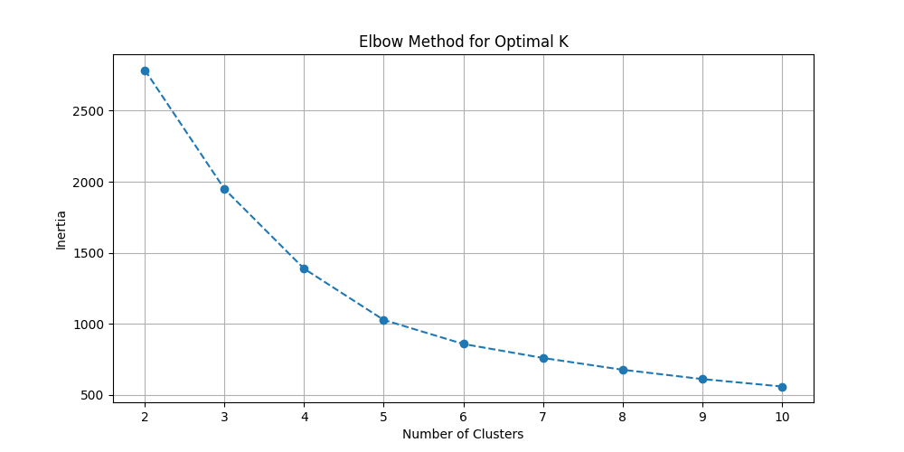
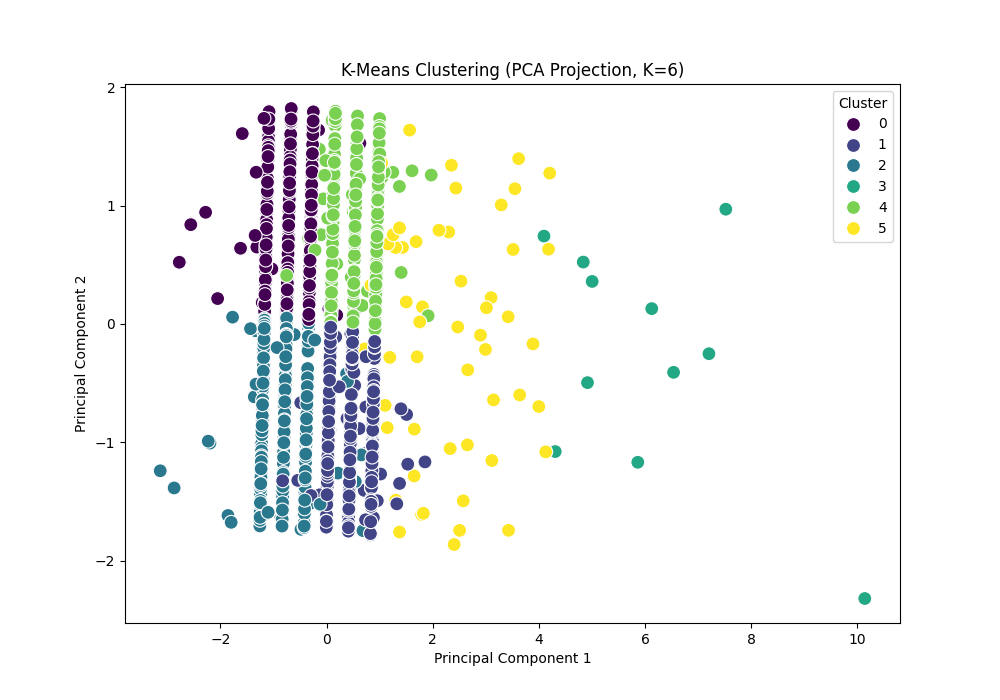
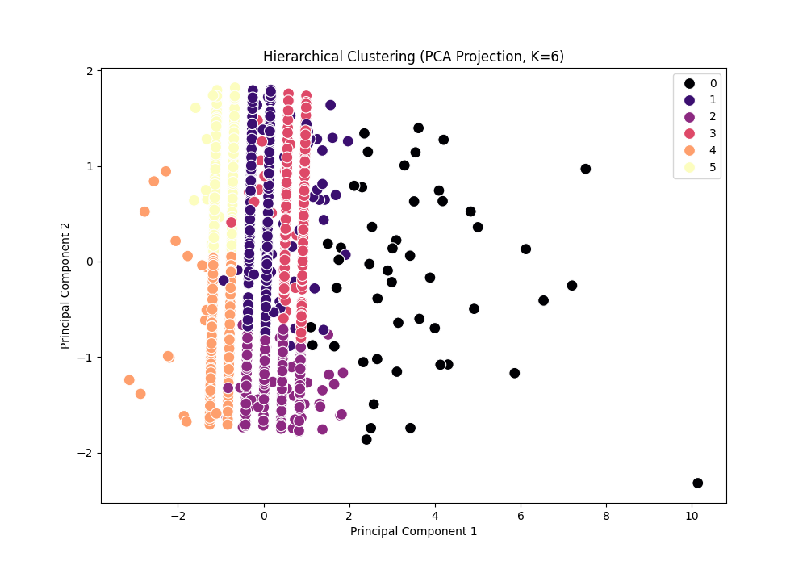

# AIML-Task-6
# 👟 Nike Sales Clustering: Market Segmentation & Anomaly Detection

**Project Status:** Completed
**Domain:** Retail Analytics / Customer Segmentation

  

## 1. Executive Summary
This project implements an unsupervised machine learning pipeline to analyze raw Nike sales data. By applying **K-Means** and **Hierarchical Clustering**, we successfully segmented 1,265 sales transactions into **6 distinct clusters**.

The analysis revealed extreme variance in sales performance, identifying high-value transactions alongside significant data anomalies (potential returns or entry errors) that require business attention.

## 2. Methodology
### Data Pipeline
1.  **Ingestion & Cleaning:** Raw data contained unformatted currency strings and null values. A regex-based cleaning pipeline was applied, resulting in 1,265 valid data points.
2.  **Feature Engineering:** Key metrics (`revenue`, `profit`, `units_sold`) were isolated and normalized using `StandardScaler` to ensure equal weighting during distance calculation.
3.  **Algorithm Selection:**
    * **K-Means:** Chosen for its efficiency.
    * **Hierarchical:** Used to validate cluster stability.

### Hyperparameter Optimization
We utilized the **Elbow Method** and **Silhouette Analysis** to determine the optimal number of clusters ($k$).
* **Result:** The Silhouette Score peaked at **$k=6$**, indicating distinct, well-separated groups.


*Figure 1: Elbow Curve showing the optimization of cluster count.*

## 3. Results & Cluster Profiling

The clustering algorithm segmented the data into 6 groups with distinct behaviors. Below is the 2D Principal Component Analysis (PCA) projection of these clusters:


*Figure 2: K-Means Clusters visualized in 2D space using PCA.*

### Cluster Profiles (Key Findings)
Based on the mean values of the generated clusters, we identified three major categories:

#### 🏆 The "High Performers" (Clusters 3 & 5)
These clusters represent the most valuable transactions for Nike.
* **Cluster 3:** The "Whale" transactions. Average Revenue: **$21,549**.
* **Cluster 5:** High-tier sales. Average Revenue: **$8,375**.
* **Actionable Insight:** These segments should be targeted for loyalty programs and premium support.

#### 📉 The "Standard/Micro" Transactions (Clusters 1 & 4)
* **Cluster 1 & 4:** Characterized by double-digit revenue (approx $37 - $66) and low profit margins.
* **Insight:** These likely represent accessory sales or clearance items.

#### 🚩 The "Anomalies" (Clusters 0 & 2)
* **Cluster 0 & 2:** These clusters show **negative revenue** (e.g., -40.78).
* **Critical Insight:** In raw sales data, negative revenue typically indicates **Returns, Refunds, or Data Entry Errors**. The model successfully isolated these "bad" data points from the healthy sales data, preventing them from skewing the analysis of high performers.


*Figure 3: Hierarchical Clustering validation showing similar structural segmentation.*

## 4. Project Structure
```bash
├── Nike_Sales_Uncleaned.csv     # Raw Data
├── analysis_script.py           # Python Source Code
├── Nike_Sales_Clustered.csv     # Output Data with Cluster Labels
├── cluster_elbow_curve.png      # Visualization 1
├── cluster_kmeans_pca.png       # Visualization 2
├── cluster_hierarchical.png     # Visualization 3
└── README.md                    # Documentation
